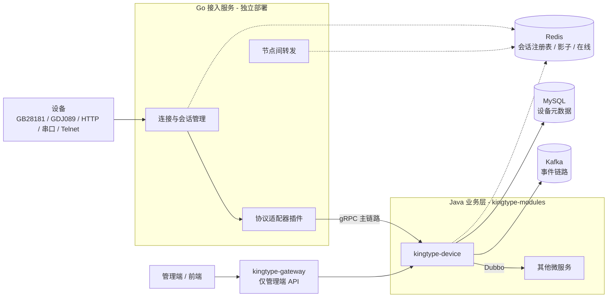

# 01 · 设备接入与管理平台架构设计基线

| 元信息 | 值 |
| --- | --- |
| 版本 | 1.0.0 |
| 日期 | 2026-08-04 |
| 状态 | 评审中 |
| 适用前提 | 万级设备；Go 接入层 + Java 业务层；Kafka 事件链路 |
| 替代文档 | 本文件为唯一权威架构文档；`archive/` 下草案不再作为实现依据 |

---

## 1. 背景与目标

### 1.1 建设目标

构建统一设备接入平台，支撑：

- 多协议接入（首期：GB28181、GDJ089、HTTP、串口/Modbus RTU、Telnet；可扩展 MQTT 等）
- 统一设备语义模型（屏蔽协议差异）
- 实时控制与异步事件解耦
- 万级设备、多节点水平扩展
- 与现有 TPro（KingType / RuoYi-Cloud-Plus 2.6.2）后端无缝集成

### 1.2 设计原则

1. **RPC 作为主链路（实时）**：Go → Java 使用 gRPC，支撑注册、状态、指令闭环。
2. **Kafka 作为事件链路（解耦/异步）**：告警、遥测、审计、下游分析。
3. **接入层不承载业务状态**：会话外置 Redis；连接本身有状态，但业务状态不落在接入节点本地。
4. **统一模型驱动业务**：协议差异止于适配器，业务只认 `DeviceEvent` / `DeviceCommand`。
5. **协议与业务隔离**：新增协议 = 新增适配器插件，不改核心业务。

### 1.3 明确不做（本阶段）

- 不在 Go 侧直连 Kafka（降低跨语言运维面；若未来为延迟优化直连，需单独 ADR）
- 不把 Kafka 当作长期时序库（历史回放靠 TSDB/DB，Kafka 保留期按业务另定）
- 不并行部署 `kingtype-gateway-mvc`（JDK 17 统一使用 `kingtype-gateway`）
- 不采用 `deviceId % N` 静态分片路由（扩缩容会全量重哈希）

---

## 2. 总体架构



### 2.1 分层职责

| 层级 | 技术 | 职责 |
| --- | --- | --- |
| 接入层 | Go（gnet/netpoll 等） | TCP/UDP/SIP/HTTP 连接、心跳、会话、协议编解码 |
| 协议适配层 | Go 插件 | 各协议 Decode/Encode，产出/消费统一模型 |
| 设备服务 | Java `kingtype-device` | 注册鉴权、影子、规则、落库、投递 Kafka |
| 事件链路 | Kafka | 异步解耦、多消费者、可回溯（受保留期约束） |
| 管理面 | Vue + Gateway + Sa-Token | 设备档案、规则配置、运维监控 |

### 2.2 核心链路

**上行主链路（实时）**

```
设备 → Go 接入 → 协议适配 → DeviceEvent → gRPC PublishEvent → Java 设备服务
```

**上行事件链路（异步）**

```
Java 设备服务 → Kafka Topics → 告警/规则/分析/审计等消费者
```

**下行控制链路**

```
业务/管理端 → Java → gRPC SendCommand → Go（查 Redis 定位节点）→ 本机连接或节点间转发 → 设备
```

---

## 3. 统一术语与数据模型

### 3.1 术语表（强制）

| 术语 | 含义 | 禁止混用名 |
| --- | --- | --- |
| DeviceEvent | 设备→平台的统一上行事件 | DeviceMessage、上行 Message |
| DeviceCommand | 平台→设备的统一下行指令 | CommandRequest、DownlinkMessage |
| ProtocolAdapter | Go 侧协议适配器接口 | ProtocolHandler（旧名废弃） |
| Session | 设备连接会话（含协议、节点、连接句柄元数据） | — |
| productKey | 产品标识，绑定租户 | — |
| tenant_id | 多租户 ID（来自产品/设备注册，非登录态） | — |

### 3.2 DeviceEvent（上行唯一标准模型）

语义：协议差异转换后的**唯一**上行入口。

```protobuf
syntax = "proto3";
package kingtype.device.v1;

import "google/protobuf/struct.proto";
import "google/protobuf/timestamp.proto";

enum EventType {
  EVENT_TYPE_UNSPECIFIED = 0;
  STATUS = 1;       // 注册/心跳/在线状态
  EVENT = 2;        // 业务事件
  ALARM = 3;        // 告警
  COMMAND_ACK = 4;  // 下行指令确认
}

message DeviceEvent {
  string event_id = 1;           // UUID，全链路追踪
  string device_id = 2;
  string tenant_id = 3;          // 由接入侧根据注册信息注入
  string product_key = 4;
  EventType type = 5;
  // data：允许数值/布尔/嵌套；禁止仅用 map<string,string>（会丢失类型）
  google.protobuf.Struct data = 6;
  google.protobuf.Timestamp device_time = 7;    // 设备侧时间（若有）
  google.protobuf.Timestamp received_at = 8;    // 接入层接收时间
  Metadata metadata = 9;
  bytes raw = 10;                // 可选：原始报文（审计/回放）
  string message_id = 11;        // 幂等键；缺省可用 event_id
}

message Metadata {
  string protocol = 1;           // GB28181 / GDJ089 / HTTP / SERIAL / TELNET
  string node_id = 2;            // 接入节点 ID
  string session_id = 3;
  string source_ip = 4;
  int32 source_port = 5;
  string topic = 6;              // MQTT 等可选
  google.protobuf.Struct extensions = 7;
}
```

Java 侧对应 POJO / MapStruct 转换时，`data` 使用 `Map<String, Object>` 或 `JsonNode`，**不得**强制全部转成 String。

### 3.3 DeviceCommand（下行唯一标准模型）

```protobuf
message DeviceCommand {
  string command_id = 1;         // 幂等与 ACK 关联
  string device_id = 2;
  string tenant_id = 3;
  string command = 4;            // 如 startBroadcast / ptz / writeRegister
  google.protobuf.Struct params = 5;
  int32 timeout_ms = 6;          // 等待 ACK 超时
  google.protobuf.Struct extensions = 7;
}

message CommandAck {
  string command_id = 1;
  string device_id = 2;
  bool success = 3;
  string code = 4;
  string message = 5;
  google.protobuf.Struct data = 6;
}
```

### 3.4 Go 协议适配器接口（唯一签名）

```go
package adapter

type ProtocolAdapter interface {
    // Name 返回协议标识，如 "GB28181"
    Name() string
    // Handshake 连接建立后的协议握手（可为空操作）
    Handshake(session *Session) error
    // Decode 原始字节 → DeviceEvent；无完整帧时返回 ErrNeedMore
    Decode(raw []byte, session *Session) (*DeviceEvent, error)
    // Encode DeviceCommand → 待下发字节
    Encode(cmd *DeviceCommand, session *Session) ([]byte, error)
    // KeepAlive 处理或响应心跳
    KeepAlive(session *Session) error
    // Close 清理协议级资源
    Close(session *Session) error
}
```

旧接口名 `ProtocolHandler.support/decode/encode`、`DeviceProtocolAdapter.init/start/stop/...` 仅出现在归档文档中，新代码不得再引入。

---

## 4. 与 TPro / KingType 后端衔接

### 4.1 模块归属

| 组件 | 位置 | 说明 |
| --- | --- | --- |
| Go 接入服务 | 建议独立仓库或 `TPro/access-gateway/`（后续落地） | 独立进程、独立扩缩容 |
| Java 设备服务 | `Server/kingtype-modules/kingtype-device` | 新建模块，根包 `com.kingtype.device` |
| API 定义 | `Server/kingtype-api/kingtype-api-device` | Dubbo Remote 接口、共享 DTO |
| 管理端页面 | `vue/src/views/device/` | 走现有前端规范 |

分层与命名遵循 `.cursor/rules/general.mdc`：Controller → Service → Mapper；实体无 DO 后缀；Bo/Vo；`IXxxService` / `XxxServiceImpl`。

### 4.2 gRPC 与 Dubbo 边界

| 调用方 → 被调方 | 协议 | 原因 |
| --- | --- | --- |
| Go 接入 → Java 设备服务 | **gRPC** | 跨语言、低延迟 |
| Java 微服务之间 | **Dubbo 3** | 与现有 KingType 一致 |
| 管理端 → 后端 | HTTP → **kingtype-gateway** | Sa-Token 鉴权 |

禁止：在 Java 业务模块之间用 gRPC 替代 Dubbo；禁止设备长连接流量进入 Spring Cloud Gateway。

### 4.3 多租户

- 设备建连时**无** Sa-Token 登录态，不能从 `LoginHelper` 取 `tenant_id`。
- 约定：`productKey`（或设备档案中的产品）在注册时绑定 `tenant_id`；接入层鉴权成功后将 `tenant_id` 写入 Session，并注入每个 `DeviceEvent` / `DeviceCommand`。
- 表实体继承 `TenantEntity`，与框架多租户插件一致。
- 跨租户访问仅允许超级管理员等显式授权路径。

### 4.4 表设计（对齐框架）

必备字段参考 `Server/documents/数据库表设计.md`（`BaseEntity` / `TenantEntity`）：

`tenant_id`、`create_dept`、`create_by`、`create_time`、`update_by`、`update_time`；建议 `del_flag`、`version`。

建议核心表（名称可落地时微调）：

| 表 | 用途 |
| --- | --- |
| `device_product` | 产品、协议类型、productKey、tenant 绑定 |
| `device_info` | 设备档案、密钥、状态 |
| `device_shadow` | desired/reported/version |
| `device_event_log` | 重要事件审计（非全量遥测） |
| `device_command_log` | 下行指令与 ACK |

全量遥测进 TSDB（可选，后续迭代），不进 MySQL 热表。

### 4.5 鉴权双路径

| 路径 | 鉴权方式 |
| --- | --- |
| 设备 → Go | deviceId + secret / 证书 / 协议自带 Digest（如 GB28181）；结果缓存于 Session |
| 管理端 → Gateway → device 服务 | Sa-Token：`@SaCheckPermission("device:xxx:xxx")` |

设备连接**不经过** `kingtype-gateway`。

---

## 5. 会话、集群与下行寻址

### 5.1 正确表述

- **错误**：接入层完全无状态。
- **正确**：接入层**不承载业务状态**；TCP/SIP 连接有状态，会话元数据外置 Redis，节点可水平扩展。

### 5.2 Session 结构（示意）

```go
type Session struct {
    DeviceID     string
    TenantID     string
    ProductKey   string
    Protocol     string
    NodeID       string    // 持有连接的接入节点
    ConnID       string    // 节点内连接标识
    LastActive   int64
    Metadata     map[string]string
}
```

### 5.3 Redis Key 约定

| Key | 内容 | TTL |
| --- | --- | --- |
| `device:online:{deviceId}` | 在线标记 / 最近活跃时间 | 约 2～3 倍心跳周期 |
| `device:session:{deviceId}` | Session JSON（含 nodeId、protocol） | 同在线或略长 |
| `device:shadow:{deviceId}` | 影子 desired/reported | 持久或长 TTL |
| `device:node:{nodeId}:conns` | 可选：节点连接集合，便于摘流 | — |

### 5.4 下行路由（禁止 deviceId % N）

1. Java / 本节点收到 `DeviceCommand`。
2. 查 `device:session:{deviceId}` 得到 `nodeId`。
3. 若 `nodeId == 本节点`：本地 `Encode` 后写入连接。
4. 若否：通过节点间通道转发（gRPC 内部服务或消息总线），由目标节点执行下发。
5. 若会话不存在：返回离线；可选写入离线指令队列（影子 desired），待上线同步。

扩缩容时只需设备重连刷新 Session，无需全网重哈希。

### 5.5 媒体流

GB28181 等媒体（RTP）建议由专用流媒体组件处理；接入层以信令与会话为主，避免在业务 JVM/Go 业务协程中做重解码。细节见协议附录。

---

## 6. Kafka 事件链路设计

### 6.1 与配置总线的区分

- `kingtype-common-bus` 当前启用的是 **AMQP**（`spring-cloud-starter-bus-amqp`）；`bus-kafka` 为注释状态。
- **配置总线 ≠ 设备事件链路**。设备事件独立使用 Kafka，互不影响。

### 6.2 Topic 规划（统一方案）

废弃文档中两套不一致命名，统一为：

| Topic | 用途 | Key | 说明 |
| --- | --- | --- | --- |
| `device.status` | 注册/心跳/上下线 | `deviceId` | 对应 EventType.STATUS |
| `device.event` | 普通业务事件 | `deviceId` | 对应 EventType.EVENT |
| `device.alarm` | 告警 | `deviceId` | 对应 EventType.ALARM |
| `device.command.ack` | 指令 ACK（可选独立 Topic） | `deviceId` | 对应 COMMAND_ACK |

不再使用单独的 `device.property` Topic；属性类上报归入 `device.status` 或 `device.event`，由 `data` 字段区分。

### 6.3 分区与有序

- **Partition Key = deviceId**：保证单设备消息在同一分区内有序。
- 分区数按万级设备与消费者并行度预估（建议起步 12～24，可运维扩容）。
- 投递语义：至少一次 + 业务幂等（`message_id` / `event_id` 去重）。

### 6.4 生产者与消费者

- **生产者**：仅 Java `kingtype-device`（在 gRPC 入站处理成功后异步/同步投递）。
- **消费组示例**：
  - `cg-device-alarm`：告警抑制与通知
  - `cg-device-analytics`：统计/报表
  - `cg-device-audit`：审计落库
- 手动提交 offset；失败重试 N 次后写入死信 Topic（如 `device.alarm.dlq`）。
- 幂等生产者：`enable.idempotence=true`（生产环境）。

### 6.5 消息体与 Schema

- Value：Protobuf 二进制或 JSON（团队二选一，建议 Protobuf 与 gRPC 共用 `.proto`）。
- Schema 演进：只增字段、不改字段语义；废弃字段保留编号。
- Header 建议携带：`tenant_id`、`protocol`、`event_type`、`trace_id`。

### 6.6 现有 docker-compose 为开发态（生产禁止照搬）

`Server/script/docker/docker-compose.yml` 中 Kafka（`apache/kafka:3.9.1`，KRaft）注意：

| 配置项 | 开发态现状 | 生产要求 |
| --- | --- | --- |
| `KAFKA_ADVERTISED_LISTENERS` | 硬编码 `192.168.31.165:9092` | 改为实际可达地址 |
| 副本 | 单节点，`OFFSETS...FACTOR=1` | 多 Broker + RF≥3 |
| `AUTO_CREATE_TOPICS` | true | **关闭**，显式创建 Topic |
| `LOG_RETENTION_HOURS` | 168（7 天） | 按遥测/告警回溯需求评估 |

示例代码可参考：`Server/kingtype-example/kingtype-test-mq` 中 `KafkaNormalProducer` / `KafkaNormalConsumer`。

### 6.7 灰度

可用双消费组并行验证新逻辑，再切主消费组；不必依赖「改 Topic 名」。回滚即停新消费组。

---

## 7. 容量设计（万级推导）

假设（可按实测调整）：

- 在线设备 \(N = 10\,000\)
- 平均心跳周期 \(T = 60s\)
- 心跳报文约 \(S = 200\) 字节
- 业务上报平均每设备每分钟 1 条，约 \(P = 512\) 字节

则：

- 心跳 QPS ≈ \(N / T ≈ 167\) 条/s
- 心跳带宽 ≈ \(167 × 200 ≈ 33\) KB/s（可忽略）
- 业务上报 QPS ≈ \(N / 60 ≈ 167\) 条/s
- 业务带宽 ≈ \(167 × 512 ≈ 85\) KB/s

结论：万级场景下瓶颈通常在**协议解析与业务规则**，而非原始带宽。建议容量目标：

| 指标 | 目标（万级） |
| --- | --- |
| 单 Go 节点连接 | 1～2 万（视协议；视频信令另计） |
| 集群连接 | ≥ 1 万，可扩至数万 |
| gRPC 主链路 P99 | < 50ms（局域网） |
| 指令下行（在线）P99 | < 100ms |
| Kafka 堆积告警 | 按消费组 lag 阈值 |

原「百万连接 / 10 万+/s」指标不作为本阶段验收标准。

---

## 8. 安全

- 传输：TLS（HTTPS / SIPS / 可选 mTLS）优先于明文 Telnet。
- 设备凭证：密钥存安全配置或 Vault；禁止文档与仓库明文密码。
- 防重放：timestamp + nonce / 协议 Digest。
- 管理面：Sa-Token + 数据权限；操作审计 `@Log`。

---

## 9. 可观测性

- 指标：在线数、每协议 QPS、gRPC 延迟、Kafka lag、下行失败率、节点连接数。
- 日志：强制带 `eventId` / `commandId` / `deviceId` / `tenantId`。
- 追踪：OpenTelemetry，跨 Go↔Java 传递 trace context。

---

## 10. 实施路线图（摘要）

1. 冻结本基线与 `.proto`
2. 搭建 Go 接入骨架 + Session/Redis
3. 实现 1～2 个协议适配器（建议先 GDJ089 或 HTTP，再 GB28181）
4. 新建 `kingtype-device` + gRPC 服务端 + Kafka 投递
5. 管理端 CRUD 与权限
6. 压测与生产 Kafka 集群化

---

## 11. 与告警抑制引擎的职责边界

| 能力 | 归属 | 说明 |
| --- | --- | --- |
| 设备侧实时规则（阈值、阈值） | `kingtype-device` 或独立规则服务 | 消费 `device.alarm` / 主链路同步判断 |
| 遗留系统告警抑制（定时/维护/关联/闪烁） | 独立抑制引擎，见 `Server/documents/核心设计方案：拦截器模式 + 规则引擎.md` | 拦截「已生成告警」的输出，非侵入老程序 |

二者可共用规则表思想，但**部署与代码库分离**，避免把遗留抑制逻辑塞进接入层。

---

## 12. 总结

> **Go 负责连接与协议；Java 负责业务与模型落地；gRPC 是实时主链路；Kafka 是异步事件链路；会话外置 Redis；管理面走现有网关与多租户规范。**

协议细节见附录 02～04；厂商识别见专题 05。
