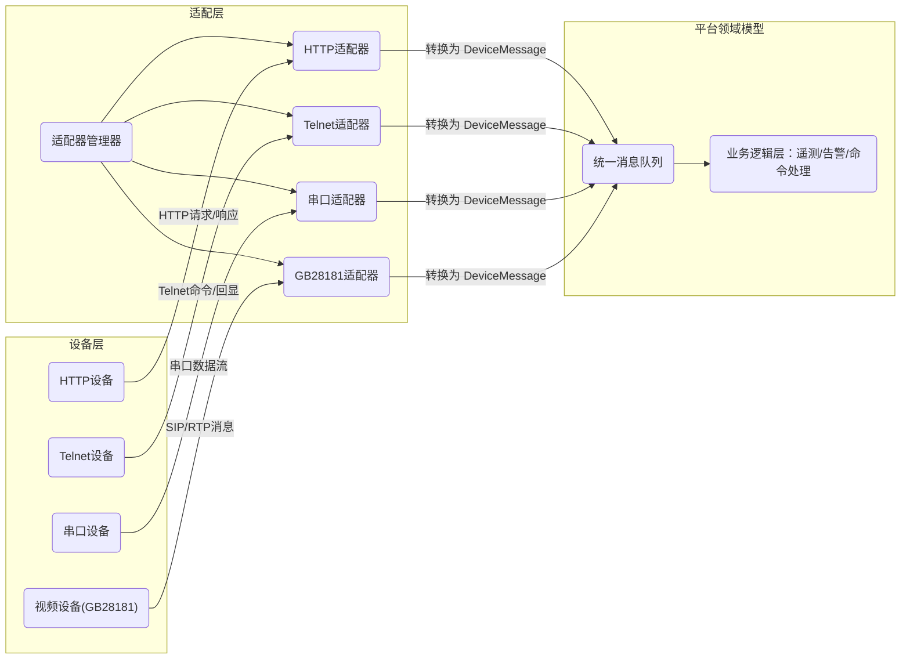

# 执行摘要  
本报告系统性分析了构建“多协议统一设备接入平台”所需的设计方案，包括对HTTP、串口(RS232/RS485)、Telnet和GB28181协议的接入要点、安全性能和常见陷阱进行详细梳理；并提出了通用的协议适配器接口设计、统一的设备消息模型、插件化框架架构、协议转换映射规则以及测试验证、部署运维建议等关键内容。针对**协议扩展性**和**接口抽象**，我们建议在适配层统一“对象寻址、能力声明、读写/订阅语义、质量/时间戳表达、错误/确认模型”这五大要素；采用插件化框架动态注册协议适配器，实现热插拔和隔离管理；定义设备消息包含设备ID、协议类型、消息类型、时间戳、数据负载及元数据等字段，并保证版本化和向后兼容；在协议转换时按命令/事件/状态映射、字段映射、单位转换、错误码映射等规则进行处理。报告还给出了兼容性、性能和安全测试方案（包括模拟设备脚本）、部署与运维建议（容器化、边缘代理、日志追踪、监控指标、滚动升级等）、协议端到端流程示例（时序图和伪代码），以及从单协议到多协议演进的迁移和回滚策略。同时提供了各协议特性对比表格以及至少五项量化设计/性能指标，如最大并发会话数、消息延迟目标、重连策略参数等，以指导工程落地。

## 各协议接入要点、陷阱、性能与安全  
- **HTTP (RESTful/JSON)**  
  - **接入要点**：HTTP广泛用于设备接入和数据传输，常以RESTful API形式上报和查询数据。典型用法是设备通过HTTPS发送JSON格式的POST/GET请求（如向`/device/v1/<AccessToken>/attributes`上报属性），平台以JSON响应结果。需要在Header中加入项目密钥等认证信息，如文档示例中要求在`Project-Key`头中携带设备认证凭证。建议尽量使用TLS1.2/1.3加密（如阿里云物联网推荐采用TLS1.3加密接入），以防止数据被窃听。  
  - **实现陷阱**：常见问题包括未使用HTTPS造成数据泄露、认证不一致（如AccessToken或项目Key配置错误导致无法访问）、URL和参数拼接错误等。同时需注意HTTP请求的超时和重试策略，避免因网络抖动造成数据丢失或重复。  
  - **性能与注意**：HTTP通信相对重量级，每次请求需建立或复用TCP连接（可启用长连接/Keep-Alive以提高性能）。对于高并发场景，应使用异步或连接池技术避免线程阻塞。HTTP消息一般较大（JSON格式），在带宽或实时性要求高时需关注压缩或限流问题。资源受限设备应避免过大payload。  
  - **安全考虑**：应强制开启HTTPS，避免明文传输。合理配置访问权限和防火墙，防止未授权访问。对可能的SQL注入或XSS无直接风险，但需防止过大请求和DO S攻击。

- **串口 (RS232/RS485)**  
  - **接入要点**：串口协议通常用于本地设备（PLC、仪表等）的连接，可配置为RS232（点对点）或RS485（多点总线）模式。在软件层面常使用Modbus RTU、ASCII或厂家自定义协议进行数据读写。需要配置波特率、数据位、校验位、停止位、流控等参数，并在操作系统层面打开对应串口驱动。读取时按协议帧格式解析（如Modbus帧含地址、功能码、校验等）。写入命令后一般需等待设备应答，串口读写通常阻塞式实现或使用事件驱动方式。  
  - **实现陷阱**：硬件接线和拓扑是关键。RS485总线两端必须加120Ω终端电阻，否则信号反射导致错误；必要时配置偏置电阻以确保空闲线路稳定。避开地回路，使用屏蔽双绞线，并采用单端接地。软件上，需统一串口参数，处理帧超时和重发机制；注意设备地址冲突和半双工冲突。  
  - **性能与注意**：串口速率一般较低（常见9600、115200bps），传输延迟相对较大。总线型连接多个设备时，问答轮询模式可能带来延迟积累。要控制轮询频率，避免端口阻塞或CPU占用过高。对于大量并发串口设备，可考虑并行多线程或多进程处理。  
  - **安全考虑**：串口通常在局域网或物理受限环境下使用，网络安全风险低。但需防止本地侵入，做好权限控制和异常校验（如CRC校验）。串口自身无加密和认证机制，可在协议层增加简单的校验或在网关层使用VPN/加密链路提升安全。

- **Telnet (远程命令行)**  
  - **接入要点**：Telnet协议通过TCP端口23提供远程命令行访问，常用于调试或管理设备（如网关、路由器、UPS等）。实现时可采用现成库（如Apache Commons Net `TelnetClient`）或以Socket方式实现简单的NVT（Network Virtual Terminal）客户端。连接设备后，一般要处理登录提示，发送用户名、密码，并解析命令提示符。然后可以向设备发送命令（如查询状态或执行控制），并解析返回的文本结果。需要关注Telnet选项协商（IAC序列）以正确开启/关闭回显等。常用模式为同步交互式，也可脚本化自动发送命令并解析输出。  
  - **实现陷阱**：Telnet通信是纯文本，一旦连接就无附加报文结构，需根据提示符解析响应。若忽略协议协商，会出现乱码或错位。命令执行后需要等待提示符或超时，否则无法确定响应结束。不同设备的提示符和输出格式各异，解析时需针对性处理。若设备掉线或断开，要及时检测并重连。  
  - **性能与注意**：Telnet适合少量交互式操作，不用于大数据传输，延迟主要在用户输入和设备响应上，通常可以接受。多设备时并发开多个连接即可，对资源占用不大。建议通过线程池或异步任务处理会话，避免阻塞主线程。  
  - **安全考虑**：**Telnet明文传输用户名/密码和命令数据，易遭窃听**。因此严禁在不可信网络（如Internet）上使用Telnet，最好仅限于内网环境。在可能的情况下应优先使用SSH替代。若必须使用，可通过VPN或SSH隧道加密连接，或限制来源IP、防火墙策略来降低风险。

- **GB28181 (国标视频监控)**  
  - **接入要点**：GB28181是公安部制定的视频监控网络标准，基于SIP协议扩展而成。接入时，设备（摄像机或NVR）向平台的SIP服务器发送两次REGISTER请求进行认证注册；注册成功后定期发送心跳保持在线。音视频流通过RTP承载（PS或TS封装）。主要功能包括实时视频点播、历史回放、云台控制、报警订阅等。实现需使用SIP协议栈（可选开源库如PJSIP、JAIN-SIP等）处理信令，并处理RTP/RTCP媒体流（如借助FFmpeg、Live555解析视频）。  
  - **实现陷阱**：GB28181协议复杂且厂家实现不完全一致。常见问题包括SIP鉴权失败（401 Unauthorized），原因可能为设备端密码错误、平台端ID/密码配置不匹配或摘要算法不一致；因此需严格对照设备ID、域编码、密码等配置。还要处理好会话ID(Call-ID)、CSeq等字段的唯一性。RTP流可能丢包或乱序，需要进行排序去重和PTS/DTS校正，否则画面会卡顿或黑屏。此外，由于SIP/RTP皆用UDP，网络抖动和NAT穿透问题也需关注。协议规范版本为**GB/T 28181-2022**。  
  - **性能与注意**：视频流对带宽和延迟敏感，应预留足够UDP带宽，避免丢包（可考虑QoS保障）。RTP解码开销大，对CPU要求较高，建议使用硬件加速或专用解码库。测试显示在无线网络环境下丢包问题尤为明显。SIP信令相对轻量，但需保持注册和心跳定时发送（一般30s~60s）。视频并发数可成为瓶颈，需要评估服务器并发处理能力。  
  - **安全考虑**：标准本身并未强制加密，SIP信令可采用TLS（SIPS），RTP可使用SRTP来加密（视设备支持情况）。平台应验证设备合法性（例如通过证书或白名单），防止伪造流注入。同时注意限制SIP端口访问、监控异常流量，以防被用于DDoS攻击或反射攻击。

## 通用 `DeviceProtocolAdapter` 接口设计  
为支持不同协议的统一接入，应定义一套抽象接口（如`DeviceProtocolAdapter`），屏蔽协议差异，提供统一的生命周期和操作方法。关键设计包括：  
- **接口方法**：例如 `init(config)`、`start()`、`stop()`、`sendCommand(DeviceCommand cmd)`、`onReceive(byte[] rawData)`、`decodeMessage()` 等。`init`用于加载配置（地址、端口、凭证等），`start`建立连接或监听，`stop`释放资源。`sendCommand`负责将统一命令转换为协议格式并发送。`onReceive`在收到原始数据时回调，调用`decodeMessage`解析为统一消息对象。  
- **生命周期与连接管理**：适配器可维护与设备的会话/连接（如TCP连接、串口句柄等），支持初始化、重连和关闭。若使用异步模式，可在启动时开启后台线程或事件循环持续监听设备数据，`stop`时关闭线程和释放资源。对状态管理进行抽象，如在连接断开后触发`onDisconnect`回调，并尝试重连。  
- **同步/异步**：部分协议（如HTTP请求/响应）天然同步，而事件驱动协议（如RTP流）为异步。设计时可支持异步事件回调：接收到消息后通过回调或事件队列推送给上层。对于同步命令调用，可返回Future或阻塞等待应答。  
- **错误处理与重连**：接口应定义异常和错误码，区分网络错误、协议错误和业务错误。对于IO异常（断线、超时等）应进行自动重连，重连策略可采用指数退避（例如初始重连间隔1s，每次*2，最大不超过60s，尝试5次后报警）。错误发生时记录日志并反馈给管理层。  
- **会话管理**：对于需要保持会话状态的协议（Telnet、GB28181等），适配器应维护会话ID、登录凭证等，并支持会话过期/刷新。可定期发送心跳或空命令验证连接存活。对于HTTP等无状态协议，可忽略此项。  
- **并发与限流**：如果同一适配器实例需要处理多个并发命令或设备，可使用线程池或异步队列来并行处理，以避免单线程阻塞。对发送请求应可限流（例如设置每秒最大请求数）以防止过载设备。同时控制并发会话数量，超过阈值时拒绝新连接或缓存消息。  
- **资源回收**：`stop()`时需关闭网络Socket、串口、释放线程及缓冲区等资源，防止内存泄漏。保证长时间运行下资源稳定。  
- **配置热更**：可以实现动态更新配置（如日志级别、命令映射、流控参数等），不重启适配器。常用方式是监听配置变更事件，在运行时重新加载部分参数，如切换目标IP或修改端口后可自动重连并生效。

## 统一设备消息模型  
为在平台内部统一处理来自不同协议的消息，应设计一个通用的设备消息（DeviceMessage）结构，包含至少以下字段：  
- **设备标识**：如`deviceId`或`resourceId`，保证在平台内唯一对应设备。可以与原生协议地址映射（适配层统一成`resourceId`，同时保留协议原生地址作为`nativeAddress`以便调试）。  
- **协议标识**：注明此消息源自何种协议（HTTP/Serial/Telnet/GB28181等），或版本号，以便后续处理时知道协议上下文。  
- **消息类型**：区分“状态上报”、“事件上报”、“控制应答”等，如`messageType`字段。  
- **时间戳**：消息生成或接收时的时间戳；可包含设备自身时戳和平台接收时戳。参照SparkplugB的做法，统一每条消息带有时间戳元数据。  
- **数据负载**：关键的属性/事件值，通常用键值对结构（Map）存放，如温度、开关状态等。可以选择JSON、ProtoBuf等序列化格式保存，**推荐使用支持扩展的格式**（如JSON或Protobuf）。  
- **单位与范围**：为每个数据项记录单位（°C、A等）或量程信息，确保不同设备数据可比；Sparkplug示例中Metric结构就包含单位等元数据。  
- **质量/状态**：如传感器状态、误码率、设备在线/离线标志等。可以用专门字段（如`status`、`quality`）或在元数据中说明。  
- **扩展点**：为向后兼容设计，允许消息中附加自定义的元数据字段，如协议版本、序列号、原始报文等。版本兼容时，应采用向后兼容的编码（如在JSON中新增字段不会破坏旧版解析）。可考虑对关键字段做版本标识。  
这样设计的消息模型确保不同协议接入后的数据在平台具有统一语义。譬如SparkplugB标准将数据抽象成Metric结构体，包含数据类型、单位和时间戳等元数据，消除了底层协议差异。类似地，本平台可为每类数据声明能力（可读/可写/可订阅），并通过统一字段表达成功应答或错误信息。  

## 插件化适配器框架架构  
采用**插件化/模块化**架构，将各协议适配器作为可热插拔组件加载。核心组件包括：适配器管理器（AdapterManager）、各协议适配器模块以及统一消息总线或队列。管理器负责扫描注册新的适配器插件（可通过Java SPI、反射或Spring Bean定义实现自动发现）、实例化并注入运行环境；同时支持在运行时添加/移除适配器实例，实现热插拔。每个适配器运行在隔离的上下文中（独立线程或Bean），通过依赖注入获取配置、日志等资源。各适配器收到设备数据后，将转换成`DeviceMessage`并推送到统一的消息队列，供上层业务逻辑消费。下图为组件关系示例：  



适配器注册发现可借助框架（如Spring的`@Component`扫描或OSGi插件机制）实现，同时利用依赖注入（DI）将配置和监控组件注入适配器实例。隔离策略上，可对重负载或不稳定的适配器限流或隔离执行，必要时启动独立进程/容器。插件化架构便于后续扩展新协议，只需新增对应的适配器插件并注册，无需修改核心代码。  

## 协议转换与映射规则  
在适配器中定义**协议间转换规则**，将统一模型的命令/事件与具体协议消息相互映射：  
- **命令/事件映射**：对于平台下发的抽象命令（`DeviceCommand`），适配器需转换为设备支持的协议格式。如统一指令“开阀门”对Modbus设备可能是写线圈寄存器，对HTTP设备可能是POST特定URL。可通过配置文件或映射表定义命令ID与协议操作（地址/功能码、URL/参数等）的对应关系。事件上报类似，对设备的协议事件（如Telnet的特定输出、GB28181的报警消息）做解析，并映射到平台的统一事件类型。  
- **字段映射**：设备发送的数据字段名、单位和结构可能各异，需要转换为统一字段名和格式。例如Modbus返回的寄存器值需应用系数和偏移进行物理量转换；HTTP JSON的键名与平台模型键名不一致时通过字段映射（如配置 `"Temp": "temperature"`）进行重命名。可使用模板或脚本（如Groovy、JSONPath）在运行时完成复杂映射。  
- **单位/编码转换**：统一系统应采用标准单位，适配器负责将设备单位转换过来（如摄氏度→开氏度，mA→A等）。字符串编码也需统一（如Telnet可能返回GBK编码的中文，需要转成UTF-8）。  
- **错误码映射**：不同协议的错误表示方式不同（HTTP状态码、Modbus异常码、GB28181 SIP Response Code等）。需要将设备端的错误转换为平台统一的错误码或状态。可维护一张映射表，将协议返回码映射到平台的错误定义。  
- **协议细节保留**：适配器可在消息元数据中保留原始协议字段（如SIP Call-ID、Telnet命令回显、串口CRC等）以便问题定位，但上层业务只处理统一字段。这种“契约优先而不抹平底层”的设计符合最佳实践。

## 测试与验证计划  
针对兼容性、性能、稳定性和安全性分别制定测试方案：  
- **兼容性测试**：为每种协议编写**模拟设备脚本**（如使用Python或bash实现的Dummy Server/Client）：HTTP可用Postman或自定义简单HTTP服务器模拟；串口可用虚拟串口工具或Loopback测试；Telnet可启动本地Telnet服务（如`inetd`或`nc -l 23`）；GB28181可使用SIPp、FFmpeg等模拟摄像头注册和RTP推流。验证平台能与各协议设备完成注册、上报、控制全流程，并正确转换消息。还应测试不同厂商设备对协议规范的偏差兼容，如GB28181的非标准字段。  
- **性能测试**：利用压力测试工具或脚本模拟大规模设备并发访问。例如对HTTP适配器可使用JMeter压测并发POST；对GB28181可并行建立多条RTP流推送，测量CPU、内存和帧率。测试指标包括系统的**最大并发会话数**、**消息吞吐量（QPS）**、**消息处理延迟**等。系统应满足业务需求，如目标下行指令响应时间<100ms，心跳超时检测<30s。记录并分析平均延迟、99%延迟分位数等指标。  
- **稳定性测试**：长时间运行测试，保持设备持续上报和心跳，检查资源使用是否稳定无泄漏；模拟设备重启/掉线多次验证平台自动重连功能。重点测试重连策略参数（如初始间隔1s、指数退避、最大重试次数）是否合理。  
- **安全测试**：对开放接口做渗透测试。HTTP接口需检查认证和授权是否能防止越权访问；模拟中间人攻击确保TLS有效；测试Telnet明文密码的风险（可借用指南进行风险评估）；对GB28181测试SIP/RTSP安全（建议验证支持SIP TLS/SRTP）。  
- **验证方法**：使用Wireshark抓包验证协议流程（如SIP REGISTER握手、Modbus帧校验等）；对比日志与预期输出。确保错误场景（异常上报、非法命令）被正确捕获和映射。  

**关键测试指标**（示例值）：  
- 最大并发会话：HTTP 1000，Telnet 100，串口100，GB28181 50；  
- 命令响应延迟目标：局域网环境下<100ms (95%)，阈值<200ms；  
- 心跳检测：设备心跳周期30s，连续3次超时判定离线；  
- 重连策略：初始1s延时，倍增退避至最大60s，最多重试5次；  
- 资源占用：每协议会话内存<50MB，总内存随并发线性增长可控；  

## 部署与运维建议  
- **容器化与边缘部署**：将适配器框架容器化（Docker/K8s），便于独立扩缩容和隔离资源。对带宽敏感或实时要求高的协议（如GB28181），可部署在本地**边缘网关**，减少网络延迟和带宽占用；核心平台集中部署剩余逻辑。  
- **高可用和升级**：对关键适配器（如核心视频服务）设计冗余部署。使用蓝绿或滚动升级策略：新版本容器启动并加入负载前先拉流测试，确认OK后下线旧版本，出问题可快速回滚。  
- **日志与链路追踪**：各适配器记录标准日志（协议握手、错误码、统计信息），并使用统一的日志格式（带有设备ID、协议等上下文）。对关键操作（如设备注册、命令发送）生成Trace ID，支持分布式链路追踪。  
- **监控指标**：为每种协议适配器输出Prometheus指标，包括：连接数、消息收发速率、处理延迟、错误率、重连次数、资源利用率等。平台整体监控CPU、内存、网络I/O，对视频流还应监测帧率和丢包率。设置告警规则（如错误率、延迟超阈）。  
- **安全加固**：在容器/宿主层面开启TLS/SSL，管理凭据和密钥。限制网络访问权限（防火墙、ACL）仅允许合法源接入设备端口。使用镜像安全扫描和密钥轮换机制，定期更新第三方协议库修复漏洞。  

## 协议端到端流程示例  
1. **HTTP 设备示例**：设备周期性上报属性，过程时序如下：  
   ```
   Device ->> Platform: HTTP POST /attributes (JSON payload, header含Project-Key)
   Platform -->> Device: HTTP 200 OK ({"result":1,"ts":...})
   Platform ->> Device: HTTP GET /attributes?keys=... (查询属性)
   Device -->> Platform: HTTP 200 OK (返回JSON属性值)
   ```  
   伪代码（Java示例）：
   ```java
   // HTTP 适配器伪代码
   HttpClient client = HttpClient.newHttpClient();
   // 发送属性上报
   HttpRequest req = HttpRequest.newBuilder()
       .uri(URI.create(url + "/device/v1/" + token + "/attributes"))
       .header("Content-Type","application/json")
       .header("Project-Key", projectKey)
       .POST(BodyPublishers.ofString("{\"temperature\":24.5,\"humidity\":60}"))
       .build();
   HttpResponse<String> resp = client.send(req, BodyHandlers.ofString());
   // 解析响应并封装为 DeviceMessage
   if(resp.statusCode()==200){
       // JSON解析响应...
   }
   ```

2. **串口设备示例**：平台通过Modbus RTU从设备读取数据：  
   ```
   Platform -> Device: (串口) 请求数据帧 [地址+功能码+CRC]
   Device -> Platform: 返回数据帧 [数据+CRC]
   ```  
   伪代码（伪Java）：
   ```java
   // 串口适配器伪代码
   SerialPort port = new SerialPort("COM3");
   port.openPort();
   port.setParams(9600, 8, 1, 0);
   // 构造Modbus读取命令
   byte[] query = {slaveAddr, functionCode, regHigh, regLow, count, CRC1, CRC2};
   port.writeBytes(query);
   byte[] response = port.readBytes(expectedLen);
   // 解析数据并生成 DeviceMessage
   int value = parseModbusResponse(response);
   ```

3. **Telnet 设备示例**：平台使用Telnet登录设备并发送命令：  
   ```
   Platform -> Device: (TCP连接)  
   Platform -> Device: "admin\n"、"password\n" （登录）  
   Device -> Platform: "Device>"  （提示符）  
   Platform -> Device: "show status\n"  （查询状态）  
   Device -> Platform: "status=OK\nvalue=123\nDevice>"  （返回结果）  
   ```  
   伪代码：
   ```java
   // Telnet适配器伪代码
   TelnetClient telnet = new TelnetClient();
   telnet.connect(host, 23);
   InputStream in = telnet.getInputStream();
   OutputStream out = telnet.getOutputStream();
   out.write(("admin\n").getBytes());
   out.write(("password\n").getBytes());
   // 等待提示符，然后发送查询命令
   readUntil(in, ">"); 
   out.write(("show status\n").getBytes());
   String output = readUntil(in, "Device>");
   Map<String,Object> data = parseKeyValues(output);
   ```

4. **GB28181 设备示例**：设备向平台注册并推流：  
   ```
   Device -> Platform (SIP): REGISTER sip:platform (包含设备ID、域编码等)
   Platform -> Device (SIP): 401 Unauthorized (请求认证)  
   Device -> Platform: REGISTER sip:platform (含 Authorization头, MD5认证)
   Platform -> Device: 200 OK (注册成功)
   Device -> Platform (SIP): OPTIONS (心跳保活)
   Platform -> Device (SIP): 200 OK
   Platform -> Device (SIP): INVITE ... (请求实时视频流)
   Device -> Platform (RTP): 推送H.264/RTP数据包
   Platform: 解包并处理PS流
   ```  
   伪代码（概念示例）：
   ```java
   // GB28181适配器伪代码 (基于SIP)
   SipStack stack = ...; // 初始化SIP堆栈
   Request register = createRegisterRequest(deviceId, platformSipUri);
   sipProvider.sendRequest(register);
   // 收到401后附带鉴权头重发
   Request register2 = addAuthorization(register, deviceId, password);
   sipProvider.sendRequest(register2);
   // 发送心跳
   sendSipMessage("OPTIONS", deviceId);
   // 点播视频
   Request invite = createInviteRequest(deviceId, sdpPayload);
   sipProvider.sendRequest(invite);
   // 在收到RTP流后，按照PS分片组装并解析视频数据
   ```

## 风险与迁移策略  
- **演进路线**：建议先从架构改造入手，引入协议适配层和统一模型，在不改变现有业务逻辑的情况下并行开发新适配器。可先实现最常用协议（如HTTP、Modbus）支持，并做好回归测试，再逐步增加Telnet、GB28181等。每次添加新协议时，通过配置启用对应适配器，将新协议的数据映射到已有模型。  
- **风险控制**：多协议扩展增加系统复杂度，需谨慎保证每个适配器模块稳定独立。数据库模型和上层逻辑尽量不要因新增协议而频繁变更。迁移时可采用AB测试或灰度发布，即先让部分设备使用新协议接入，验证无误后全面推广。确保日志和链路监控完善，以便快速定位故障。  
- **回滚策略**：若新适配器或统一模型出现问题，应能快速切回旧方案：一方面可禁用对应适配器，恢复设备原有接入方式；另一方面保留历史数据模型版本，使平台仍能处理旧协议数据。对于GB28181等涉及视频核心功能的改动，建议预留备用流路或手动恢复选项。通过模块化设计，保证一个协议的故障不会影响其他协议及系统核心功能。  

| 协议     | 特性描述                             | 优先级 | 实现复杂度 | 测试难度 | 运维成本 |
| -------- | ----------------------------------- | ----- | ---------- | -------- | -------- |
| HTTP     | 通用REST/JSON接口，设备主动上报/拉取 | 高    | 低         | 中       | 低       |
| 串口     | RS232/RS485物理层，多点总线，半双工  | 高    | 中         | 中       | 中       |
| Telnet   | 远程文本命令行，明文无加密            | 中    | 低         | 中       | 中       |
| GB28181  | 基于SIP/RTP的视频监控协议            | 中    | 高         | 高       | 高       |

**设计/性能指标示例**：最大并发会话数（HTTP 1000，Telnet/Serial 100，GB28181 50）；命令响应延迟目标（局域网<100ms）；心跳超时阈值（缺省30s，连续3次超时认为离线）；重连策略（初始1s退避，指数倍增，最大60s，最多尝试5次）；资源占用（每连接内存<50MB，长时间稳定运行）。  

**参考文献**：协议规范与行业资料。