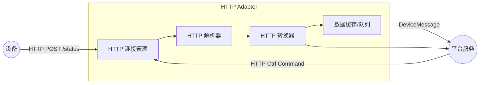
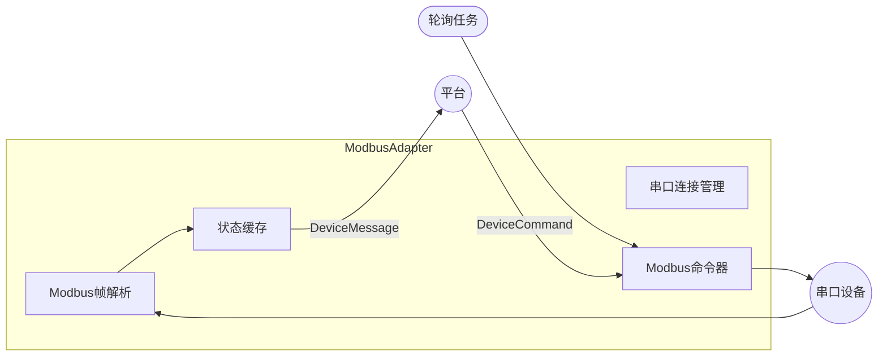

# 多协议统一设备接入平台设计分析报告

## 执行摘要
本报告针对**多协议统一设备接入平台**的设计进行了深入分析，旨在构建一个支持至少 HTTP、串口(RS232/RS485/Modbus RTU)、Telnet、GB28181 协议的通用 DeviceProtocolAdapter 接口与扩展机制，并保证新增协议时对核心架构影响最小。我们提出了一种**协议适配器层 (Adapter Layer)**架构，将协议解析逻辑与业务层彻底解耦。每种协议由独立的适配器模块(Adaptor)处理，核心只使用统一的设备消息模型 (DeviceMessage)。。适配器可动态加载和插拔，以支持新协议或私有协议扩展，如通过插件模式实现模块化扩展。在设计上，需要逐项考虑通用数据模型、会话管理、命令语义、心跳和告警、文件/媒体流、安全运维、并发性能、序列化编码、时间同步、元数据等关键维度。本报告以工程可实施为导向，结合开源网关和协议规范，提出通用接口设计示例、消息模型定义、部署方案、安全措施，并通过 Mermaid 流程图演示 HTTP 上报、Serial(Modbus RTU) 轮询、Telnet 查询、GB28181 视频注册与预览等典型场景。报告结论指导实现一个**高可扩展、可维护**的多协议设备接入平台。

## 背景与目标
在工业物联网/智慧安防场景中，不同设备往往使用不同的通信协议：现代智能设备常用 **HTTP/REST**；传统工业设备可能通过 **串口(Modbus RTU)** ；网络设备或老旧控制器常用 **Telnet(ASCII CLI)** ；视频监控设备使用 **GB28181**（SIP+RTP）。如果平台只支持少数协议，就难以统一管理。这份方案的目标是搭建一个**多协议统一接入平台**，核心设备模型不关心底层协议，只需要通过适配器将各协议的数据转换为标准格式。平台第一版本至少支持 HTTP、Serial (RS232/485 Modbus RTU)、Telnet、GB28181，并留出灵活扩展接口，未来可接入 MQTT、Modbus TCP、OPC UA、BACnet 等协议，只需开发对应适配器而不改动核心逻辑。

## 关键设计维度
我们从以下维度逐项设计：

- **通用数据模型**：定义统一消息结构，将各种协议的上行/下行数据抽象为标准格式。典型字段包括设备ID、协议类型、消息类型(event/status/alarm/command)、时间戳、载荷(data)及元数据(metadata)等，例如：  
  ```json
  {
    "deviceId": "dev001",
    "protocol": "HTTP",
    "type": "status",
    "timestamp": 1690100000000,
    "data": { "temperature": 35.5, "online": true },
    "metadata": { "url": "/device/status", "contentType": "json" }
  }
  ```  
  编码方面支持 JSON、Protobuf 等；对二进制数据可使用 Base64 或 Protobuf `bytes`。可选地支持压缩（如gzip）和数字签名（如HMAC或JWS），以确保传输效率和完整性。消息模型留出`metadata`字段存协议标签（端口、波特率等）。

- **会话/连接管理**：不同协议连接模型差异巨大。HTTP 通常**无状态**、基于请求/响应；串口无TCP连接概念，使用物理串口帧分隔；Telnet 基于 TCP（监听23端口）的全双工会话；GB28181 使用 SIP 会话（UDP/TCP 5060）和 RTP 流。适配器需要为每种协议维护连接状态：持久连接（如Telnet、SIP）、轮询计时器（如Modbus Poll）、短链接（HTTP请求即开即关）。连接管理模块负责打开/关闭连接、检测链路健康、重连策略等。例如，Serial 适配器会持续打开串口并按周期发送读命令；Telnet 适配器可采用长链接或每次创建短连接；GB28181 适配器需要模拟 SIP 用户代理，管理注册心跳和INVITE会话。

- **命令/响应语义**：上行（设备→平台）通常为状态上报、事件通知，下行（平台→设备）为控制指令、参数设置。语义要保持一致：例如，通过HTTP POST携带JSON上报状态，平台以DeviceMessage格式接收；Modbus则读写寄存器返回数值，上报封装为“status”类型；Telnet下发CLI命令收到文本输出，要在解析后封装为“status”或“ack”；GB28181上行如报警、目录查询请求也是用XML信令，在适配器解析后变为统一事件消息。下行控制命令在DeviceMessage中也携带命令类型和参数，适配器根据协议生成原生命令。例如：  
  ```java
  // 通用命令对象示例
  class DeviceCommand {
      String deviceId; String protocol;
      String command; Map<String,Object> params;
  }
  // 例如MODBUS写寄存器命令：
  DeviceCommand cmd = new DeviceCommand("meter001", "ModbusRTU", "WRITE_REGISTER", {"register":40010, "value": 220});
  ```
  适配器需支持同步（阻塞等待应答）和异步（回调事件）两种模式，必要时用Future/Promise返回结果，或通过事件总线发布响应。错误处理应统一：如解析错误、超时等可映射为特定错误码或异常，传递给上层并记录告警。

- **心跳/健康检查**：对支持长连接的协议（GB28181、Telnet），平台/设备需定期交换心跳包以证明在线。GB28181 明确规定设备须定期发SIP KEEPALIVE；Telnet设备可能没有固有心跳，可由平台周期性发送空命令（如 NOP）检测；HTTP 可在应用层要求设备定期上报状态。平台可主动进行健康检查：比如通过HTTP定期轮询，或Telnet发`'help'`命令检查响应。超时或失败时，触发重连或报警。

- **事件/告警**：设备异步事件（如报警、按钮触发、异常状态等）需及时上报平台。对于支持推送的协议（如HTTP设备可通过Webhook发送消息），适配器直接转换为事件消息。对于不能主动推送的设备（串口、Telnet），可通过轮询抓取变化，或使用设备自身告警输出（GPIO、Modbus报警寄存器等）并映射为事件。GB28181使用SIP MESSAGE/Notify等发送告警，适配器需解析相关XML报文。平台对告警可进行分类处理，接口设计应支持事件类型过滤和告警级别。

- **文件/媒体流**：部分设备产生文件或流媒体。例如，摄像头通过 GB28181 提供实时视频流（RTP）。视频流不适合序列化进 DeviceMessage，一般直接转发到视频服务或按时段保存。适配器需管理媒体通道：GB28181 适配器需根据平台下发的实时请求（SIP INVITE）建立 RTP/RTCP 会话；并可将流转发给指定服务或存储。对于非实时文件（如FTP上报日志），适配器可下载文件后将摘要或路径封装入消息。设计上，**MediaService**或**FileService**等独立模块可以订阅事件、获取媒体数据。

- **认证/鉴权**：不同协议有不同机制。HTTP常用Token、Basic Auth或OAuth；Telnet通常有登录用户名密码（多为明文）；串口协议本身无内置鉴权，可在应用层加入口令参数或使用物理隔离；GB28181 设备注册时可携带口令使用SIP Digest认证（例如国家标准建议采用基于口令的摘要认证）。适配器和平台需验证设备身份，建议统一使用设备ID+密钥或证书方式。例如，适配器在解析上行消息时，校验消息签名或密码；下行命令前插入认证头。ACL(访问控制)策略应支持按设备、功能限制权限（可参考AWS IoT Gateway安全策略）。

- **重连与容错**：网络故障或设备异常时，系统应自动重连并恢复状态。适配器应实现重试机制：如TCP断开后持续尝试重连，Modbus超时重发，HTTP请求失败重试等。采用指数退避并限制次数以避免风暴。失败后产生告警并记录日志。为了高可用，可以部署多个适配器实例，共享状态（如通过分布式缓存）来平滑接管失败节点的任务。

- **并发与吞吐**：工业现场可能同时管理数百乃至上千设备，要求高吞吐。设计上可为每种协议类型创建线程池或使用异步框架。借鉴 Neuron v2 星型总线架构，采用高效消息路由和多线程。例如，每个Adapter可在独立线程/Actor中运行，通过订阅-发布机制与核心通信，实现多核并发处理。序列化/编码采用零拷贝或对象池等手段优化性能。

- **序列化/编码**：上行协议数据格式参差，如 HTTP JSON、XML，Telnet ASCII 文本，Modbus 二进制帧。适配器需支持对应的编码解码器：可以通过**责任链模式**(Chain of Responsibility)分段解析帧，如先去掉Modbus RTU CRC后再解析数据，有序传递给下层解析器。统一消息层面可使用 JSON/Protobuf 作为格式，以降低差异。对于多媒体，可封装为流格式（RTP）不经转换。

- **时间同步**：对实时性要求高的场景，需要设备时间对齐。可利用设备定时上报的时间戳，或在初始化时通过NTP/SNTP命令同步设备时钟。GB28181 有校时消息，设备注册时可与平台校时。DeviceMessage 中应包含时间戳字段，避免时区差异或网络延迟影响数据一致性。

- **元数据与协议标签**：每条DeviceMessage可包含`metadata`字段记录协议相关信息：如 HTTP 的 URL、HTTP头；串口的端口号、波特率；Telnet的VT100控制码；GB28181的通道编号(Channel)等。这有助于上层业务决策和日志跟踪。

## 通用 DeviceProtocolAdapter 接口设计
核心定义一个**协议适配器接口**(`DeviceProtocolAdapter`)，屏蔽具体协议细节。例如（Java 伪代码）：
```java
public interface DeviceProtocolAdapter {
    // 初始化配置（可选）
    void init(Map<String,Object> config);

    // 启动适配器（建立连接、注册服务等）
    void start();

    // 停止适配器、释放资源
    void stop();

    // 解码接收到的原始数据，生成 DeviceMessage
    DeviceMessage decode(byte[] data) throws DecodeException;

    // 向设备发送控制命令，内部根据协议封装和下发
    void send(DeviceCommand command) throws ProtocolException;

    // 心跳/健康检查，返回设备在线状态或健康度
    DeviceStatus healthCheck();
    
    // 适配器元信息：协议名、版本、支持特性等
    AdapterInfo getInfo();
    
    // 可选回调/监听器注册，用于通知上层新消息、异常等
    void setMessageListener(MessageListener listener);
}
```
各方法语义：
- `init(config)`：传入协议特定参数（如串口名、IP端口、认证信息等），为适配器做准备。
- `start()`/`stop()`：启动或终止连接、线程等。`start()` 中可能启动监听线程或定时任务，例如串口轮询或心跳发送。
- `decode(data)`：当适配器底层（如TCP接收、串口读帧）获得数据后调用，用于解析成通用的`DeviceMessage`。实现中一般先进行帧同步和校验（CRC/PARITY），然后提取业务字段。
- `send(command)`：将通用`DeviceCommand`转为协议格式并发送。例如，对于Telnet，将命令字符串写入SSH/Telnet会话；对于Modbus，将函数码和参数打包为RTU帧；对于HTTP，可通过REST POST/PUT请求下发。
- `healthCheck()`：可以是发送PING或模拟命令、或检查最后心跳时间是否超时，返回如`ONLINE`/`OFFLINE`/`UNKNOWN`状态。

**扩展点**：接口设计应允许可选功能。例如可以定义默认接口方法或`AdapterCapabilities getCapabilities()`来声明该协议支持的特性（如流媒体、批量命令、事件通知等）。通过策略模式(Strategy)，适配器内部可选载入不同解析策略或命令策略，使其行为可定制。

**同步/异步模型**：适配器可提供同步阻塞调用（适用于发送命令立即等待响应），也可采用异步回调或事件总线（如Akka Actor模式）。在异步模式下，可在`MessageListener`接口中加入`onMessage(DeviceMessage msg)`和`onError(Throwable e)`等回调，让平台实现自身的事件驱动逻辑。错误和状态码体系应统一：可定义枚举`ProtocolException`携带错误类型和消息。

**示例接口说明**：  
```java
DeviceProtocolAdapter mqttAdapter = new MqttAdapter();
mqttAdapter.init({"brokerUrl":"tcp://...", "clientId":"gw1"});
mqttAdapter.start();
// 当接收到MQTT报文时，适配器内部自动调用 listener.onMessage(...)
```
每种协议都实现相同接口即可无缝接入平台。

## 协议私有扩展机制
为了支持协议特有的命令和参数，而不修改核心接口，可采用插件化/策略模式。每个协议适配器内部都可维护一个**协议驱动**（Driver）或**解析链**，处理自定义逻辑。具体机制包括：

- **插件化加载**：使用类加载器或反射动态加载第三方适配器。例如ThingsBoard IoT Gateway允许将自定义Connector和Converter放入`extensions`目录，并通过配置文件自动注册。我们可仿照该方案：在配置（如YAML/JSON）中指定协议驱动名称和类，启动时扫描加载。  
  ```json
  adapters:
    - name: MySerial
      type: serial
      class: com.example.gateway.adapter.CustomSerialAdapter
      configFile: custom_serial.yaml
  ```
  插件只需实现`DeviceProtocolAdapter`接口并注册到管理器，系统按需启停。

- **策略/工厂模式**：协议命令和帧解析可抽象为策略接口，如`FrameParser`、`CommandFormatter`等。不同设备或厂商的协议扩展可以通过注入不同实现来支持。例如，Modbus RTU可以支持多种寄存器布局，通过策略决定解析方式。使用**工厂模式**创建协议对象：如根据配置动态实例化不同的帧解析类。

- **能力发现**：适配器可暴露协议特性列表，平台据此决定如何交互（如某协议是否支持批量查询、是否有应答机制）。也可通过**元数据协议**（如YAML/JSON描述帧结构）来驱动通用解析器。示例协议描述文件（YAML）：
  ```yaml
  protocol: CustomCLI
  delimiter: "\r\n"
  commands:
    - name: SHOW_STATUS
      request: "SHOW STATUS\n"
      responsePattern: "TEMP=(?<temp>\\d+)"
      fields:
        temp: int
  ```
  适配器启动时加载此描述，自动生成`Command`和`Parser`。

- **二进制帧解析**：对二进制协议(如Modbus、BACnet)可定义字节流处理管道。例如使用责任链模式逐层解析：一个处理者先去除头尾、校验CRC，传给下一个解析功能码和数据。这种模式利于插入额外的检查或解析步骤。

- **流媒体通道**：GB28181等协议含双通道（信令+媒体），可将媒体部分拆分到单独模块。如MediaAdapter管理RTP流，与信令适配器协同工作。协议驱动可以包含**流媒体转发器**或**解复用器**，通过工厂模式创建合适的媒体解码或转发策略。

- **CLI命令集**：对于Telnet/SSH，可能存在批量命令或脚本。可采用模板模式，将通用控制命令参数化；或使用脚本引擎（如Jython）解析复杂命令。适配器接口允许向下调用原始命令，也支持通过策略接口扩展新的命令类型。

## 上行/下行通用消息模型增强设计
基础的`DeviceMessage`模型需要增强字段和层次结构，以满足不同协议特性：

- **字段与元数据**：除`deviceId/type/data`外，应加入`protocol`(协议名)、`timestamp`、`messageId/correlationId`等字段。`metadata`字段为可选键值对，记录协议标签（如网络层端口、串口号、通道ID等）。  
- **协议专用载荷**：`data`字段可为嵌套对象或协议特定的结构。对于HTTP/JSON可直接放原始键值；对于二进制数据可以是数组或编码后的字符串；对文件或媒体流，可放URI或流描述。必要时使用`oneof`或`Any`类型（Protobuf）承载不同协议的数据。  
- **分层序列化**：内层消息为原始协议数据，上层封装统一格式。例如，二进制Modbus帧先解为寄存器值，再封装成JSON；需要传输大数据时可先序列化后再压缩；签名字段可独立附加。  
- **示例定义**（Protobuf）：
  ```protobuf
  syntax = "proto3";
  message DeviceMessage {
    string deviceId = 1;
    string protocol = 2;
    string type = 3;
    int64 timestamp = 4;
    map<string,string> metadata = 5;
    google.protobuf.Any payload = 6;
  }
  // payload可按协议定义具体消息结构，如StatusMessage, AlarmMessage等
  ```
  如果使用JSON，可给出示例：
  ```json
  {
    "deviceId": "cam01",
    "protocol": "GB28181",
    "type": "alarm",
    "timestamp": 1690100001000,
    "metadata": { "channel": "001", "sipId": "340200..." },
    "data": { "alarmType": "motion", "level": 5 }
  }
  ```  
- **压缩与签名**：对于批量数据或媒体，可使用压缩库(zlib, Snappy)对`payload`进行压缩；安全方面，可在应用层签名消息或使用TLS链路，亦可在消息模型中增加`signature`字段（如HMAC）。

## 适配器生命周期与部署模型
适配器可以多种部署方式：内嵌在主进程（in-process）或独立进程/容器（out-of-process）。  
- **内嵌部署**：适配器作为库或模块运行在服务器进程中，调用简单但易造成资源竞争。适合协议数量少、性能要求不高的场景。  
- **独立进程/边缘网关**：常见于资源隔离需要高的工业网关。各协议适配器可运行在各自容器中，实现完全隔离和独立重启。例如使用 Docker 部署，每个适配器容器包含所需驱动和运行时环境，通过网络相互通信。这提高了稳定性和安全性，同时便于水平扩展和负载均衡。参考 AWS IoT Greengrass、KubeEdge 等将适配器容器化的方案。  
- **资源隔离与伸缩**：容器化还可以设置 CPU/内存限制，防止单协议问题影响整个平台。对重负载协议，可部署多个实例并放在负载均衡器后。连接池策略：如数据库或MQTT客户端连接可复用，以提高并发吞吐。  
- **横向扩展**：对于海量设备接入，可在多节点部署网关集群，使用消息队列或服务总线(如NNG、Kafka)分发数据。每个适配器实例独立维护一部分设备，通过订阅-发布模型减少耦合。

## 安全与运维
安全设计包括设备端和平台端：  
- **密钥管理**：设备凭证（密码、令牌、证书）应安全存储，可用安全模块(HSM)或Vault管理。使用 HTTPS/MQTT TLS等加密链路，避免明文传输。对于GB28181，遵循国标建议使用口令摘要认证。平台需定期更新证书/密钥并支持吊销。  
- **证书与ACL**：支持双向TLS或安全路由，建立设备与平台间的信任关系。使用访问控制列表(ACL)限制设备可执行的操作：如只允许读协议状态、特定主题等。  
- **审计日志**：系统需记录设备接入、命令执行、配置变更等关键操作。按照安全基线，平台应收集设备端关键日志（联网状态、升级状态等）用于安全监控。所有日志至少包含时间、设备ID、协议、操作类型和结果。  
- **协议降级**：应对高负载或故障情况，可临时关闭复杂协议仅保留核心功能。如网络不稳时允许设备用更简单的HTTP轮询模式上报，减少资源占用。  
- **监控指标与告警**：关键指标包括：连接数、消息吞吐量、失败率、时延分布、CPU/内存使用率等。对每个适配器可监控会话状态、重连次数、命令队列长度等。推荐使用 Prometheus 等监控组件；在日志中跟踪`deviceId`, `protocol`, `messageId`等字段以便追踪。链路追踪系统如Jaeger可给TCP/SIP会话和应用层调用关联上下文ID，用于故障排查。

## 兼容性与演进策略
新协议接入时，核心变化最小：只需实现新的 `DeviceProtocolAdapter` 并注册即可，不影响已有代码。采用语义版本控制(SemVer)策略：接口大改动时升级主版本，新增功能次版本，修复补丁级。向后兼容可通过接口兼容默认实现或者可选能力字段，例如新字段默认空值，不破坏老服务。升级协议时，可按以下步骤：先在隔离环境验证新适配器，再部署灰度替换，观测稳定后全量切换。例如当Modbus RTU切换到Modbus TCP：可并行运行两个适配器，逐步迁移设备配置。详细的兼容性保证还需文档记录协议版本差异。  

## 示例场景与端到端流程图

下面使用 Mermaid 绘制4种协议的典型交互流程，标注适配器内部模块（连接管理、解析器、转换器、缓存、命令队列等）：


*图：HTTP上报与命令流程（设备通过HTTP上报状态，平台通过HTTP发送控制）*


*图：串口(Modbus RTU)轮询流程（平台周期轮询设备寄存器上报状态）*

```mermaid
flowchart LR
    subgraph TelnetAdapter
      TC[Telnet连接管理]
      TP[Telnet解析器]
      TF[命令格式化/解析]
    end
    DeviceTelnet((设备))
    Platform3((平台))
    Platform3 -->|DeviceCommand| TC
    TC -->|send "show status"| DeviceTelnet
    DeviceTelnet -->|回复文本| TP
    TP --> TF
    TF -->|DeviceMessage| Platform3
```
*图：Telnet CLI查询流程（平台发送CLI命令，解析设备文本响应）*

```mermaid
flowchart LR
    subgraph GB28181Adapter
      GC[SIP会话管理]
      GP[GB28181信令解析器]
      GM[RTP流管理]
    end
    Camera((监控摄像机))
    Platform4((监控平台))
    Camera -->|SIP REGISTER| GP
    GP --> GC
    GC -->|DeviceMessage(注册事件)| Platform4
    Platform4 -->|实时预览请求| GC
    GC -->|SIP INVITE/200OK| Camera
    Camera -->|RTP视频流| GM
    GM -->|转发至视频服务| VideoService
```
*图：GB28181设备注册与实时预览流程（摄像机注册平台并响应预览请求发送视频流）*

以上流程图展示了各协议适配器的内部模块如何协同：连接管理负责网络/串口通道，解析器负责协议解码，转换器封装为通用消息，并通过缓存或队列与平台交互。

## 协议差异对比表

|协议|连接模型|传输层|典型设备|上行触发模式|下行控制模式|常见编码|是否媒体流|认证方式|错误处理|
|:--|:--|:--|:--|:--|:--|:--|:--|:--|:--|
|HTTP|无状态请求/响应|TCP/IP (REST)|网关、传感器、摄像头|主动上报(HTTP POST)、订阅推送|REST API调用|JSON/XML|否|Token/Basic/TLS|HTTP状态码、超时重传|
|Serial (Modbus RTU)|主从轮询|RS232/RS485 串口|PLC、电表、传感器|被动轮询（主站发请求，设备响应）|主站写寄存器|二进制（功能码+数据+CRC）|否|无内置，或应用层口令|CRC错误检测|
|Telnet|全双工会话|TCP (23端口)|UPS、网络设备、控制器|被动查询（平台发送命令）|CLI文本命令|ASCII文本 (VT100转义)|否|用户名/密码登录|命令执行错误、超时|
|GB28181|SIP信令 + RTP流|UDP/TCP (5060 SIP) + RTP|IP摄像头、NVR|主动注册/心跳，上行设备目录|SIP控制（INVITE/PLAY）|XML(SIP消息)，RTP(H.264等)|是 (视频+音频)|SIP摘要/证书|SIP回复码、掉线重连|

以上表格列出了各协议的关键差异，如HTTP无状态、JSON载荷，对比Modbus RTU的二进制帧、Telnet的ASCII命令、GB28181的SIP+RTP混合等。可以看出GB28181独有媒体流部分，而其他协议多为控制/数据流。认证方式也多样（无到TLS再到口令认证）。不同协议对错误处理方式不同：HTTP 使用状态码和超时重试，Modbus 使用CRC检测并可能重发，Telnet需解析CLI错误提示，GB28181依赖SIP信令回复。

## 设计模式与实现建议
在设计中可借助多种软件设计模式提高可扩展性与可维护性：

- **适配器模式 (Adapter Pattern)**：将各种协议“包装”成统一接口，正如**适配器模式**让不兼容接口的对象能协同工作一样。每种协议适配器即是一个Adapter，客户端(平台)只与其通用接口交互，无需关心内部细节。例如`ModbusAdapter implements DeviceProtocolAdapter`。这样新协议加入时，只需新增Adapter实现而不改动平台逻辑。

- **策略模式 (Strategy Pattern)**：协议处理过程中常有可替换算法，如不同厂商Modbus寄存器解析、不同HTTP认证方式等。将它们封装为策略类，通过配置或上下文在运行时切换，可以提高灵活性。例如定义`DataParser`策略接口，不同协议或版本实现不同解析；运行时注入合适实例。

- **责任链模式 (Chain of Responsibility)**：适用于**分层解析**和**处理流程**。可将帧边界检测、CRC验证、命令解析等步骤依次组成链式处理器，每个处理器完成部分工作后传递给下一个。这种方式方便插入额外检查或调试，不同处理者间低耦合。举例：`CRCHandler -> FunctionCodeHandler -> PayloadHandler`组成解码链。

- **工厂模式 (Factory Pattern)**：可用来创建适配器、连接器、解析器等对象。比如根据协议类型字符串，通过工厂返回相应的适配器实例。这样可以在运行时根据配置动态实例化，且符合开放封闭原则。示例伪码：  
  ```java
  AdapterFactory factory = AdapterFactory.getInstance();
  DeviceProtocolAdapter adapter = factory.createAdapter(protocolName);
  adapter.init(config);
  ```
  工厂还可被扩展为使用配置文件或反射加载类名，支持插件机制。

- **插件模式 (Plugin Pattern)**：允许系统在运行时加载/卸载模块。具体可实现一个插件框架：主程序提供插件注册点，外部jar或脚本实现`DeviceProtocolAdapter`接口并自注册。符合界面规范的插件在启动时自动加入系统功能，而无需修改核心代码。例如，通过Java SPI或Spring的依赖注入机制扫描`adapter-*.jar`里的适配器类。

- **Actor/Reactive 模式**：对高并发需求，可采用Actor模型（如Akka）或Reactive框架（如Project Reactor）。每个设备连接作为一个Actor/事件流，接收消息并处理，自带异步和容错机制。这样可以充分利用多核CPU，提高吞吐。比如每个适配器线程作为一个Actor，内部处理消息并异步下发结果，或使用RxJava对消息流进行反应式处理。Actor模式有助于设计独立状态与消息隔离的组件，故障时也可只影响单个Actor。

上述模式的混合使用可以使系统**模块化、灵活可扩展**：Adapter 模式主干，工厂/策略简化配置，链模式处理复杂逻辑，插件机制支撑动态扩展，Actor/Reactive保证并发性能。

## 主要参考来源
- GB28181 协议规范和解析文档；Telnet/RFC854；HTTP/1.1 RFC7231；Modbus RTU 规范；  
- Neuron V2.0 工业网关架构；ThingsBoard IoT Gateway 扩展机制；EMQX Device Agent 白皮书；  
- ITU-T X.1352 IoT安全标准；消费级物联网安全基线；  
- RefactoringGuru 设计模式教程（Adapter、Strategy、Chain of Responsibility、Factory）；CSDN插件模式解析等。  

以上来源为本设计报告提供了理论基础和最佳实践指导。设计方案在保证**架构原则**的同时，也高度关注**工程可实施性**，为未来新增协议或功能迭代提供充足的扩展空间。