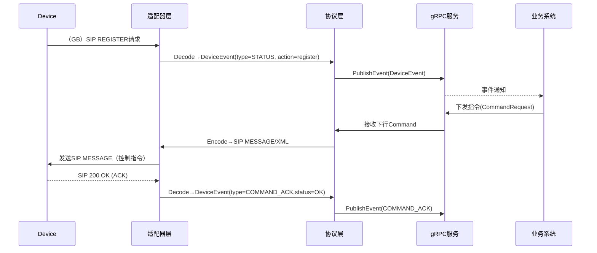

# 执行摘要

本报告深入分析在同一系统中同时支持**GB28181视频监控协议**与**GDJ+089-2018应急广播大喇叭协议**的可行性和工程化设计。重点聚焦设备侧协议接入层和协议层（raw ⇄ 统一DeviceEvent模型）设计。我们假设两协议彼此独立、互不影响，支持TCP/UDP/SIP/RTSP/HTTP/MQTT等传输方式，系统语言和框架不做特定限制。主要结论：GB28181使用基于SIP的会话控制与RTP媒体流；GDJ089对大喇叭IP适配器采用**TCP短连接**传输，定义了二进制报文格式、业务码（如0x01开始广播、0x02停止等）和心跳机制。我们提出了一个统一的接入层架构，采用适配器模式支持多协议并行接入，并在协议层将两协议的上行报文映射为**DeviceEvent**事件，同时根据DeviceEvent反向生成下行报文。报告包含详细的比较表、接口定义、示例报文、映射策略、时序图和实现路线图，力求全面、技术可落地。  

# 1. 协议特性对比

| 特性         | GB/T28181（视频监控） | GDJ+089-2018（应急大喇叭） |
|-------------|---------------------|----------------------|
| **消息模型** | 基于**SIP**信令交互，消息体通常携带XML（MANSCDP）或SDP；<br>媒体流使用RTP/RTCP。 | 二进制报文协议，**TCP短连接**方式；<br>数据包含固定长度头部、业务体、CRC校验。 |
| **会话/注册** | 设备向平台（SIP UAS）发起**REGISTER**注册〈用户名@域〉，采用摘要式认证（401→auth）。<br>会话通过SIP Call-ID、CSeq维持。 | GDJ089无显式“登录”流程；IP适配器在接入时可直接通过TCP连接向平台等待指令。会话由平台给出的**会话ID**管理，见附录D，数据包头中包含“SessionID”字段。  |
| **认证鉴权** | 使用SIP的**Digest认证**（WWW-Authenticate/Authorization）机制，用户名为设备国标ID。 | TCP层可支持**TLS或预共享Key**，但规范未定义；可在应用层签名和证书字段保护数据（头部含签名标志、证书编号、数字签名等）。 |
| **心跳保活** | 设备周期性向平台发送SIP **MESSAGE**（消息类型Notify，CmdType=Keepalive）报文。默认周期60s，携带设备ID及状态信息（MANSCDP XML格式）。平台响应200 OK。 | 设备周期性发送业务类型0x10的“终端心跳”数据包。业务数据内容可为空，主要用于在线状态上报。平台收到后可回复业务类型与请求相同的应答。心跳间隔可自定义，一般为30–60秒。 |
| **媒体流**   | **视频监控数据**通过**RTP/RTCP**承载，通常由SIP INVITE建立会话后开始推流。支持TCP或UDP传输。 | 主要针对语音播发，无专门媒体流要求：<br>– 应急广播可通过本地RDS、FM、IP等多路输出；<br>– GDJ089 IP适配器本身无特殊媒体流协议，仅在被动接收平台下发的音频流，如通过RTP多播播放。 |
| **控制命令** | 平台通过SIP **MESSAGE**发送控制命令（XML格式），如设备参数设置、开关机等；设备通过回复SIP 200 OK或另外的MESSAGE反馈处理结果。 | 平台向适配器下发二进制控制指令（业务类型0x01、0x02等），如“开始播发”“停止播发”等；适配器执行后应发送**通用应答**（业务类型与请求一致）反馈结果。 |
| **上行/下行方向** | **上行（设备→平台）**：REGISTER、Heartbeat（MESSAGE）、报警通知（MESSAGE）、流媒体（RTP）。<br>**下行（平台→设备）**：控制命令（MESSAGE）、查询（MESSAGE）、流媒体拉取（INVITE）。 | **上行**：设备主动上报心跳、故障、切换、播发结果等（业务类型0x10/0x11/0x13/0x14等）；<br>**下行**：平台下发广播指令（业务类型0x01/0x02）、查询指令（0x11）、参数设置（0x12）等。 |
| **可靠性** | SIP可选UDP（易丢包）或TCP；消息重传依赖SIP重传机制；**媒体**可选RTP/RTCP（通常UDP+FEC）。需处理网络抖动。 | 使用TCP保证传输可靠性；报文含**CRC32校验**；应用层增加签名确保安全完整。适配器主动应答保证命令闭环，超时重发需平台实现。 |
| **时序要求** | 心跳典型60秒一次；流媒体延迟一般可接受1s左右。SIP事务需严格按顺序(CSeq)处理。 | 时延要求较低。适配器应在收到启动播发指令后立即执行；心跳及故障上报应及时响应（可低至几秒级）。协议设计支持并行多播，多区域播发。 |
| **示例报文** | *设备→平台* REGISTER:  
```sip
REGISTER sip:34020000002000000001@3402000000 SIP/2.0  
Via: SIP/2.0/UDP 192.168.0.100:5060;branch=z9hG4bK1  
From: <sip:34020000001320000003@3402000000>;tag=1  
To: <sip:34020000001320000003@3402000000>  
Call-ID: 1234567890  
CSeq: 1 REGISTER  
Contact: <sip:34020000001320000003@192.168.0.100:5060>  
Expires: 3600
```
*设备→平台* 心跳（MESSAGE，MANSCDP XML）见。 | *平台→设备* 开始播发命令（业务类型0x01）:  
```hex
FE FD 01 00 ... [Header] ... 01 00  ... [业务体开始播发指令]
```
*设备→平台* 心跳包（类型0x10，业务体空）:  
```hex
FE FD 01 00 ... [Header] ... 10 00  [CRC32] 
```
二进制结构详见附录D。 |
| **端口/传输** | 默认SIP端口5060（UDP/TCP），RTP端口协议可协商；依赖DNS/SIP域模型。 | IP适配器通常连接到平台指定TCP端口（如6000等）；协议本身无固定端口要求。可使用TLS等增强安全。 |

# 2. 接入层架构设计

我们设计一个**统一接入层**框架，支持多协议并行接入。总体架构如下：

- **多协议适配器**：针对各协议实现不同的协议适配器（Protocol Adapter）。每个适配器监听自己的传输端口（如SIP端口5060、GDJ IP端口6000），负责**解析（Decode）和封装（Encode）**对应协议报文。  
- **统一网关服务**：提供统一的接入入口，维护设备会话与连接（Session）。会话信息可保存在内存+Redis，以支持横向扩展。  
- **协议层调用**：接入层解析完原始报文后，将规范化的 `DeviceEvent` 转发给核心业务层（通过gRPC PublishEvent）。下行时，核心层发来 `CommandRequest`，由适配器Encode后发往设备。  

#### 会话管理与状态

- 会话信息（`Session`）结构记录设备ID、连接对象、最后活跃时间等。示例：  
  ```go
  type Session struct {
      DeviceID    string
      Conn        net.Conn   // TCP/UDP/UDP listener object
      LastActive  int64
      Protocol    string     // e.g. "GB28181" 或 "GDJ089"
  }
  ```
- 设备连接建立时（如TCP握手后），调用 `RegisterSession(deviceID, conn)` 注册；断开时 `CloseSession(deviceID)`；心跳/收发数据时更新 `LastActive`。会话表可以存于Redis，用作负载均衡的索引。  

#### 适配器接口定义

每个协议适配器需实现以下接口（示例Go伪码）：  
```go
type ProtocolAdapter interface {
    Handshake(conn net.Conn) error
    Decode(raw []byte, session *Session) (*DeviceEvent, error)
    Encode(event *DeviceEvent, session *Session) ([]byte, error)
    KeepAlive(session *Session) error
    Close(session *Session) error
}
```
- **Handshake**：完成初始握手，如GDJ089可无额外交互，GB28181可能监听REGISTER请求等。  
- **Decode/Encode**：将原始字节流与统一模型 `DeviceEvent` 相互转换。  
- **KeepAlive**：处理或响应心跳（如发送回应报文）。  
- **Close**：关闭底层连接，清理资源。  

##### 协议适配器示例

| 适配器    | Handshake                           | Decode                                      | Encode                                 | KeepAlive              | Close        |
|---------|------------------------------------|--------------------------------------------|----------------------------------------|------------------------|--------------|
| **GB28181Adapter** | 监听SIP UDP/TCP请求，处理初次REGISTER认证；可无实际握手过程。 | 解析SIP消息（REGISTER/MESSAGE/INVITE等），提取DeviceID、type（如“Heartbeat”、“Alarm”）、并生成DeviceEvent。 | 根据DeviceEvent类型构造SIP MESSAGE/INVITE等，例如下发控制命令时生成 MESSAGE/XML；| 收到KEEPALIVE MESSAGE后回复200 OK；| 发送SIP BYE或直接断开。 |
| **GDJ089_IPAdapter** | 接受TCP连接，可能无额外握手，直接进入数据交互。 | 解析自定义TCP报文头（0xFEFD...会话ID、业务类型、数据长度、CRC），根据业务类型（0x10/0x01/0x02等）生成DeviceEvent。 | 将DeviceEvent中的下发指令映射到协议报文（如业务类型0x01开始播发、0x02停止播发等），填充源/目标编码、长度等，计算CRC。 | 对业务类型0x10心跳报文无需回复，或回复对应应答包； | 关闭TCP连接。 |

#### 接口与示例报文

- **函数/HTTP/gRPC接口**：接入层内部可以通过gRPC与业务层通信。示例：  
  ```go
  rpc PublishEvent(DeviceEvent) returns (Ack);        // 设备上报事件
  rpc SendCommand(CommandRequest) returns (CommandReply); // 平台下发指令
  ```
- **示例报文**：  
  
  - *GB28181 登录包（SIP REGISTER）*：
    ```sip
    REGISTER sip:34020000002000000001@3402000000 SIP/2.0
    From: <sip:34020000001320000003@3402000000>;tag=2043466181
    To:   <sip:34020000001320000003@3402000000>
    Call-ID: 1011047669
    CSeq: 1 REGISTER
    Contact: <sip:34020000001320000003@192.168.0.100:5060>
    Expires: 3600
    ```
  - *GDJ089 开始播发命令（示意）*：  
    
    ```
    [Header: FE FD 01 00 ... ][业务类型=0x01][业务长度=...][业务体=开始播发指令数据][CRC32] 
    ```
- **Session存储示例（Redis Key）**：  
  - `session:{deviceId}` – 存储Session结构序列化数据（IP、端口、协议等）。  
  - `online:{deviceId}` – 在线状态布尔/超时。  
  - `stream:{deviceId}` – 媒体流相关信息（SDP、SSRC等）。

# 3. 协议层映射策略

协议层仅做“**报文与统一模型DeviceEvent的双向映射**”，不嵌入业务逻辑。我们定义扩展后的DeviceEvent结构（示例Proto/JSON）如下：

```protobuf
message DeviceEvent {
    string eventId = 1;      // 唯一事件ID（可用UUID）
    string deviceId = 2;     // 设备国标ID或适配器资源编码
    string type = 3;         // 事件类型：STATUS/ALARM/EVENT/COMMAND_ACK等
    map<string,string> data = 4;    // 业务数据键值对
    int64 timestamp = 5;     // 事件时间戳
    map<string,string> metadata = 6; // 协议、会话、来源IP等元数据
    bytes raw = 7;           // 原始报文（便于审计/重放）
}
```

## 3.1 上行报文映射（设备→平台）

- **GB28181（SIP→DeviceEvent）**：  
  - **REGISTER**：`deviceId`取自SIP URI，映射为`DeviceEvent.type = "STATUS"`，在`data`中可记录`action=register`和结果（成功/失败）。  
  - **心跳(MESSAGE)**：`DeviceEvent.type = "STATUS"`或“HEARTBEAT”，`data`例如`{"heartbeat": true, "status": "OK"}`，并在`metadata["protocol"]="GB28181"`、`metadata["Call-ID"]`等字段中记录上下文。  
  - **告警/事件(MESSAGE)**：`CmdType=Alarm/Info`等，`DeviceEvent.type="ALARM"`，`data`内填报警代码、级别等，根据MANSCDP协议（参考GB28181-2016 A.2.x）。  
  - **控制指令执行结果**：设备执行平台下发指令后，可能以SIP MESSAGE或200 OK应答反馈，可生成`type="COMMAND_ACK"`或相应状态事件。  

- **GDJ089（IP报文→DeviceEvent）**：  
  - **心跳(业务类型0x10)**：映射为`type="STATUS"`或"HEARTBEAT"；`data`可空或包含设备状态，如`{"status":"OK"}`。`metadata["sessionId"]`、`metadata["sourceCode"]`等填入SessionID和源编码。  
  - **查询应答(0x11)**：如适配器对状态查询的响应，`type="STATUS_RESPONSE"`，`data`填查询结果。  
  - **故障/任务切换(0x13/0x14)**：分别映射为`type="FAULT"`和`type="TASK_SWITCH"`事件，`data`中填故障代码或任务ID。  
  - **播发结果上报(0x15)**：`type="PLAY_RESULT"`，`data`填播发成功/失败信息。  

**映射示例：**

| 业务场景                | 原始协议报文                                  | 生成的DeviceEvent                       |
|-----------------------|-------------------------------------------|--------------------------------------|
| GB28181注册成功        | SIP/2.0 200 OK (REGISTER响应)             | `{type:"STATUS", deviceId:"340200..", data:{"action":"register","result":"OK"}}`  |
| GB28181心跳(MESSAGE)    | `MESSAGE ... <CmdType>Keepalive</CmdType>...` | `{type:"STATUS", deviceId:"340200..", data:{"heartbeat":true}, metadata:{"protocol":"GB28181"}}` |
| GDJ089开始播发指令(下行) | `... 业务类型=0x01 ...`（来自平台）        | (不生成DeviceEvent，上行不触发)         |
| GDJ089心跳(0x10)       | `... 业务类型=0x10 ...`（设备上报）        | `{type:"STATUS", deviceId:"DEVICE123", data:{}, metadata:{"protocol":"GDJ089"}}` |
| GDJ089故障上报(0x13)   | `... 业务类型=0x13 ... [故障代码] ...`     | `{type:"ALARM", deviceId:"DEVICE123", data:{"error":"..."} }` |

## 3.2 下行报文映射（平台→设备）

下行时，我们根据`DeviceEvent`或业务侧`CommandRequest`生成原始协议报文：

- **统一下行模型**：业务层通过gRPC传递`CommandRequest{deviceId, command, params,...}`。协议层转换为一个内部结构`DownlinkMessage{deviceId, command, params, timeout}`。

- **GB28181**：将`CommandRequest`映射到SIP MESSAGE/INFO/INVITE。例如，`command="play"` 可生成SIP MESSAGE，其中`XML.CmdType="Play"`；`command="setVolume"`生成MANSCDP相应指令。填充`Call-ID/CSeq`等并通过SIP通道发送。

- **GDJ089**：根据命令类型生成二进制包。如`command="startBroadcast"`对应业务类型0x01，“stop”对应0x02，`params`填入表D.5/D.6定义的字段。组装协议头（资源编码、目标编码）、业务体、长度和CRC。示例：  
  ```go
  func EncodeStartBroadcast(cmd *CommandRequest) ([]byte,error) {
      header := []byte{0xFE,0xFD,0x01,0x00}  // 包头标记+版本
      sessionID := make([]byte,4) // 平台生成或来源Session
      // ... 填充会话ID、数据包类型、源编码、目标数、目标编码等
      bizType := byte(0x01)  // 开始播发
      bizData := encodePlayData(cmd.Params) // 构造业务内容
      dataLen := uint16(len(bizData))
      packet := append(header, sessionID...)
      packet = append(packet, 0x01, 0x00, // 请求包, 未签名
                          byte(len(bizData)>>8), byte(len(bizData)&0xFF))
      packet = append(packet, bizData...)
      crc := CRC32(packet)  // 计算CRC32
      packet = append(packet, uint8(crc>>24), uint8(crc>>16), uint8(crc>>8), uint8(crc))
      return packet, nil
  }
  ```
- **COMMAND_ACK/影子闭环**：对于下发命令，设备（或适配器）应发送通用应答（SIP 200 OK或GDJ的应答包）回报执行结果。协议层收到后生成`DeviceEvent{type:"COMMAND_ACK", data:{"cmdId":..., "status":"SUCCESS"}}`，以便业务层确认闭环。对于配置参数，可更新影子同步字段，确保预期状态与设备报告状态一致。

## 3.3 媒体流处理

- **GB28181**：媒体流（RTP/RTSP）一般由专用媒体服务器处理。接入层可在协议层仅做信令透传，不直接处理音视频包。或使用SRS/WMS等转发流媒体。例如SRS中GB28181用TCP推流；接入层将设备流转发至流媒体服务。协议层仅需解析INVITE/200 OK中SDP，填充metadata（IP/端口/SSRC），供下游使用。
- **GDJ089**：该协议本身对音频流无专门定义。IP适配器可能从平台接收音频流（可通过RTP组播），并本地播出。接入层可支持将下行RTP流输送到适配器或音箱，如使用UDP/Multicast。对于音频传输协议（RTP/TS/TS over IP），需参照GDJ089相关附录（如附录D、F）。

# 4. 会话与路由设计

- **协议路由**：接入层根据连接端口或协议标识选择相应适配器。例如，将SIP请求路由到GB28181Adapter，将GDJ089 TCP连接路由到GDJ089_IPAdapter。可配置**虚拟网关**模式，实现协议隔离。  
- **设备标识映射**：GB28181使用20位国标ID作为deviceId（如“34020000001320000003”），可直接作为统一ID。GDJ089 IP协议的“数据源对象编码”（12字节）可定义为deviceId（需去除前4bit，BCD编码23位数字）。两者建议使用不同前缀（如GB_与GDJ_）区分空间。  
- **消息ID关联**：  
  - **GB28181**：利用SIP的Call-ID+CSeq作为事务ID。当平台下发命令时，可记录Call-ID和CSeq，设备回复200 OK后匹配事务。DeviceEvent中可在`metadata["Call-ID"]`、`metadata["CSeq"]`中存储。  
  - **GDJ089**：使用报文头中的“SessionID”字段管理一次请求回复周期。平台每发新命令增大SessionID（4字节递增）。设备响应包带相同SessionID，便于关联。可在DeviceEvent.metadata里加入`"sessionId"`和业务`"seq"`。  
- **下行路由策略**：核心层下发命令到gRPC接口（指定deviceId）；接入层查找`Session=deviceSessions[deviceId]`获取连接，并调用相应ProtocolAdapter.Encode后写入该连接。若设备离线，可缓存指令待恢复。  
- **Redis Key设计**（仅示例）：

  | Redis Key            | 内容                                             |
  |----------------------|------------------------------------------------|
  | `online:{deviceId}`  | 在线状态 (`true`/`false`) 或存活时间戳；E.g. 过期时间=90秒防假在线。 |
  | `session:{deviceId}` | 会话信息（连接ID/IP端口/协议）JSON序列化，用于路由下行。    |
  | `shadow:{deviceId}`  | 设备影子状态（Reported/Desired JSON），存储最新上报和预期状态。  |
  | `stream:{deviceId}`  | 媒体流信息（如GB28181流的SSRC、端口），用于播放调度。        |

# 5. 兼容性与冲突解决

- **端口冲突**：GB28181默认使用5060/UDP（也可TCP），GDJ089可使用自定义TCP端口（建议避免使用5060）。采用独立监听端口和协议栈隔离。如在同机时，GB适配器绑定SIP端口，GDJ适配器绑定不同端口（如6000）。  
- **消息格式冲突**：两协议报文风格完全不同（SIP文本VS二进制流），接入层可根据协议头自动识别，无冲突。确保各适配器严格按照协议解码，避免混淆。  
- **命名空间冲突**：设备ID可能重复（两协议均用数字字符串）。建议在统一平台中加前缀或字段区分，例如`"GB:3402..."` vs `"GDJ:12345678..."`。  
- **资源竞争**：媒体转发资源、计算线程等共享时需隔离。可采用多实例或容器化部署，不同协议服务单独伸缩。  
- **安全隔离**：避免协议侧互相攻击或干扰。在网关层面使用防火墙规则隔离GB和GDJ流量，仅在应用层互通。

# 6. 性能与可靠性建议

- **并发连接**：设计需支撑**成千上万**设备并发注册和心跳。接入层使用高效异步网络库（如Go/gnet），采用协程池+事件循环模式。心跳周期性触发保活检查，对于超时设备做下线处理。  
- **媒体带宽**：GB28181视频流要求较高带宽，应部署流媒体分发节点（CDN或反向代理）缓解负载；接入层可只保留信令处理，不转发流或使用轻量级代理。  
- **重试/超时/ACK**：对于关键命令采用超时重试机制。GB28181利用SIP本身的ACK与重传机制；GDJ089下发指令后若超过预设ACK超时应重发或报警。平台日志记录所有命令原始报文（raw）用于审计和追踪。  
- **持久化/审计**：保存`DeviceEvent.raw`字段到数据库或日志系统，以便回放分析。事件落库时带上时间戳与来源IP。可为重要事件（如告警）配置持久存储。  
- **测试用例与验证**：编写功能验证：设备注册、重复注册、心跳丢包、故障上报、指令下发后ACK等；性能测试：模拟大量设备同时注册、心跳和流媒体播放场景；互操作测试：同时加载GB和GDJ设备，确认彼此隔离且各自功能正常。  
- **时序图示例**（典型上行与下行流程）：



# 7. 实施路线图

我们建议分阶段迭代交付：

| 阶段        | 输出成果                               | 粗略人日 | 优先级 |
|------------|-------------------------------------|-------|-------|
| 1. 需求与协议设计  | *Proto文件*（DeviceEvent、Command等），<br>*技术文档*（协议映射规则） | 5~8  | ★★★★☆ |
| 2. 接入层骨架搭建  | *Go接入层代码框架*（多协议支持的网关）<br>*Session管理、Redis结构* | 5~10 | ★★★☆☆ |
| 3. 协议适配实现  | *GB28181Adapter模块*（SIP解析/生成）<br>*GDJ089_IPAdapter模块*（报文解析/生成） | 8~12 | ★★★★☆ |
| 4. 协议层集成    | *Protocol Layer代码*（统一DeviceEvent映射）<br>*集成测试*（双协议混合） | 5~8  | ★★★★☆ |
| 5. 测试与验证    | *测试用例集*（单元+集成+压力），*中间件部署脚本* | 5~8  | ★★★☆☆ |
| 6. 部署与优化    | *部署文档*，*性能调优*（并发/流量测试） | 3~5  | ★★☆☆☆ |

**参考文献：** GB/T28181-2016标准、GD/J089-2018规范等，以及相关技术资料。

